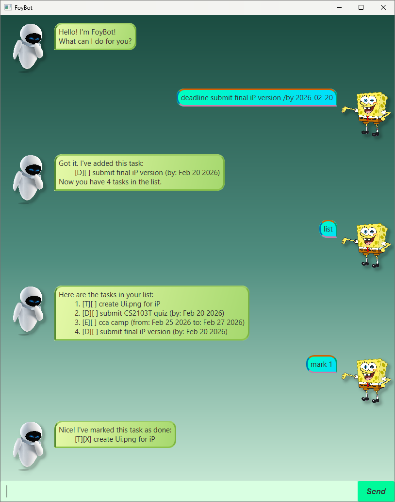

# FoyBot User Guide

FoyBot is a task-tracking chatbot for managing todos, deadlines, and events.

## Quick Start

1. Ensure you are using **JDK 17**.
2. From the project root, run: `./gradlew run`
3. Chat with FoyBot in the GUI window.

## Command Summary

- `list`
- `todo <description>`
- `deadline <description> /by <yyyy-mm-dd>`
- `event <description> /from <yyyy-mm-dd> /to <yyyy-mm-dd>`
- `mark <task number>`
- `unmark <task number>`
- `delete <task number>`
- `find <keyword>`
- `help`
- `bye`

## Features

### 1. List all tasks: `list`

Shows all tasks with numbering.

Format: `list`

### 2. Add a todo task: `todo`

Adds a basic todo task.

Format: `todo <description>`

Example: `todo revise recursion notes`

### 3. Add a deadline task: `deadline`

Adds a task with a due date.

Format: `deadline <description> /by <yyyy-mm-dd>`

Example: `deadline submit iP draft /by 2026-03-01`

### 4. Add an event task: `event`

Adds a task with a start and end date.

Format: `event <description> /from <yyyy-mm-dd> /to <yyyy-mm-dd>`

Example: `event cs2103t iP consultation /from 2026-03-03 /to 2026-03-03`

### 5. Mark a task as done: `mark`

Marks a task by its displayed number.

Format: `mark <task number>`

Example: `mark 2`

### 6. Unmark a task: `unmark`

Marks a task as not done.

Format: `unmark <task number>`

Example: `unmark 2`

### 7. Delete a task: `delete`

Removes a task by number.

Format: `delete <task number>`

Example: `delete 3`

### 8. Find tasks: `find`

Searches tasks by keyword (case-insensitive).

Format: `find <keyword>`

Example: `find draft`

### 9. Show help: `help`

Displays in-app usage instructions.

Format: `help`

### 10. Exit FoyBot: `bye`

Closes FoyBot.

Format: `bye`

## Notes and Constraints

- Task numbers are **1-based** (first task is `1`).
- Date fields must use `yyyy-mm-dd`.
- For events, `/from` date must be before or equal to `/to` date.
- Commands are keyword-based (e.g., `todo`, `deadline`, `list`).
- Greeting words like `hi`, `hello`, and `hey` are also supported.

## Data Storage

FoyBot auto-saves tasks to: `data/foybotSaved.txt`
